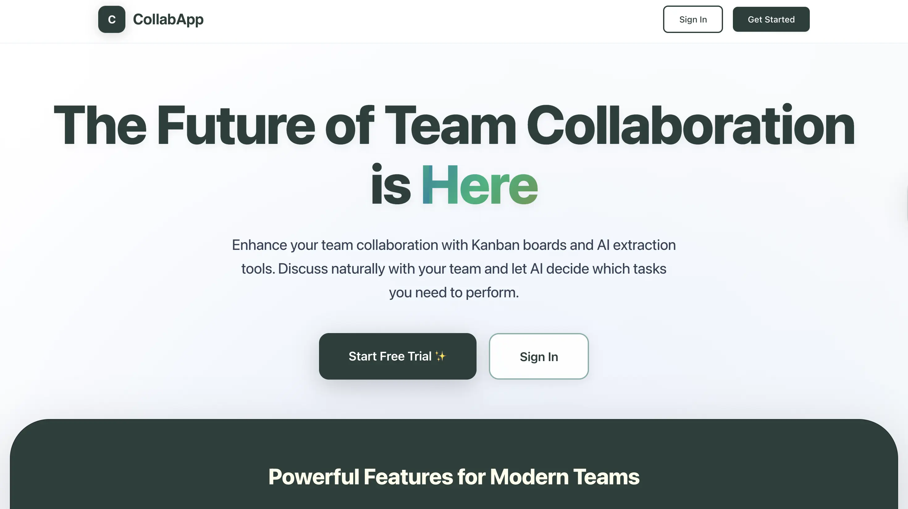

# Imane Idrissi - Full-Stack Developer Portfolio

I believe technology should serve people and create real impact. Complexity alone is never the goal. Beyond coding, I love building lasting skills, like learning strategies that let me tackle anything I need anytime.

## 🌟 Beyond the projects: discover the stories and decisions behind them

**Live portfolio:** [imaneidrissi.com](https://imaneidrissi.com)

---

##  Projects

### CollabApp - Collaborative Task Management Platform

A collaborative platform that combines a Kanban board with a chat app. What makes it different is an AI feature that turns group conversations into actionable tasks that are registered within the task board.

#### Featured Capabilities:

<table>
  <tr>
    <td width="50%">
      <h4>📋 Kanban Task Board</h4>
      
      
Visual task management with drag-and-drop functionality across customizable columns.

    </td>
    <td width="50%">
      <h4>💬 Integrated Chat System</h4>
      
      
Real-time team communication seamlessly integrated with task management.

    </td>
  </tr>
  <tr>
    <td width="50%">
      <h4>🤖 AI Task Extraction</h4>
      
      
Automatically converts chat conversations into actionable tasks with confidence scoring.

    </td>
    <td width="50%">
      <h4>📝 Rich Modal System</h4>
      
      
Comprehensive task creation and editing with intuitive modal interfaces.

    </td>
  </tr>
</table>

[View Live Demo](https://imaneidrissi.com/projects/collab-app) | [Documentation](https://imaneidrissi.com/projects/collab-app#chat-app-ai-extraction)

---

### Style App - E-commerce Platform

An online store where users can browse women's, men's, and kids' categories with subcategories. Shoppers can select items with the right size and quantity, add them to the cart, and complete their purchase through Stripe payments.

#### Key Features:
- **Multi-category browsing** (Women's, Men's, Kids')
- **Size and quantity selection** for each product
- **Shopping cart management** with real-time updates
- **Secure checkout** with Stripe integration
- **User authentication** with Google OAuth and email/password
- **Order history** for registered users
- **Responsive design** for all devices

[View Live Demo](https://imaneidrissi.com/projects/e-commerce) | [See Case Study](https://imaneidrissi.com/projects#e-commerce)

---

## 🛠️ Tech Stack

### Frontend
- React.js & TypeScript
- Styled Components
- Context API for state management

### Backend
- Node.js & Express.js
- RESTful API architecture
- JWT authentication

### Database & Storage
- MongoDB for data persistence
- Firebase for real-time features
- AWS S3 for media storage

### Integrations
- Stripe API for payments
- Google OAuth for authentication
- Custom AI algorithms for task extraction

### Deployment
- GitHub Pages for portfolio
- AWS (S3, Amplify, Lambda) for applications
- CI/CD with GitHub Actions

---

## 📫 Contact

Looking to bring your digital ideas to life? Let's connect and explore the possibilities!

[Get in Touch](https://imaneidrissi.com/contact)

---

## 📄 License

This project is open source and available under the [MIT License](LICENSE).